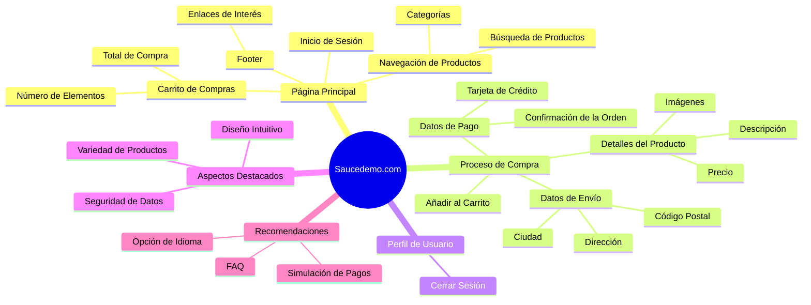

[TOC]

# Descripción del proyecto 

El sitio [saucedemo.com](https://www.saucedemo.com/) es un sitio de prácticas que simula una tienda de venta de ropa y accesorios en línea. Ofrece a los usuarios la posibilidad de explorar un catálogo de productos, ordenarlos según el criterio establecido, agregar artículos al carrito de compras, realizar pagos y completar los datos de la compra.

La automatización de las pruebas permitió simular las interacciones de los usuarios con el sitio web. Se desarrollaron casos de prueba que cubrieron diversas funcionalidades, como la navegación por las diferentes secciones del sitio : el orden de los productos según un criterio, el proceso de compra, la gestión del carrito y la verificación de la integridad de los datos.

Para lograrlo, se utilizó el framework **Selenium**, que proporciona una interfaz de automatización de navegadores web. Se empleó el lenguaje de programación Java para desarrollar los scripts de prueba y se aplicaron técnicas de **Page Object Model (POM)** para mejorar la estructura y reutilización del código.

El proyecto demostró habilidades en el diseño de casos de prueba, la implementación de scripts de automatización, el uso de Selenium Web Driver y el conocimiento de programación en Java. Además, se prestaron especial atención a los aspectos de mantenibilidad y extensibilidad del código, lo que facilita futuras actualizaciones y mejoras del proyecto.

La automatización de las pruebas en el sitio  [saucedemo.com](https://www.saucedemo.com/)  resultó en una mayor eficiencia, ya que se redujo el tiempo necesario para realizar pruebas manuales repetitivas. Además, proporcionó una mayor confiabilidad en la detección de errores y problemas funcionales, lo que a su vez mejoró la calidad del sitio web.

 <strong>   Analisis Funcional del sitio web Saucedemo.com </strong>  
 

## 1. Resumen del proyecto 

El proyecto de automatización del sitio saucedemo.com consistió en desarrollar una serie de pruebas automatizadas utilizando el framework Selenium con el lenguaje de programación Java. El propósito principal fue demostrar habilidades en automatización de pruebas y garantizar la calidad del sitio web bajo prueba.

## 2. Objetivos

- Automatizar pruebas de funcionalidad para mejorar la eficiencia y precisión de las pruebas.
- Reducir el tiempo y los recursos requeridos para realizar pruebas manuales.
- Detectar errores y problemas en el sitio web de manera temprana.

## 3. Alcance

En el proyecto se realizará la automatización de los casos de prueba para validar las siguientes funcionalidades: 

 - **Inicio de Sesión**
 - **Cierre de Sesión**
 - **Generación de una orden de compras**
 - **Ordenar productos** 

## 4. Tecnologías utilizadas

Para la construcción del proyecto se emplearon las siguientes tecnologías , librerías , técnicas y herramientas de desarrollo:

### 4.1 Tecnologías 

- **Selenium Web Driver:** Framework de automatización de pruebas para interactuar con los elementos de la interfaz de usuario.
- **Java**: Lenguaje de programación utilizado para desarrollar las pruebas automatizadas. 
- **TestNG**: Framework de pruebas utilizado para la ejecución y gestión de los casos de prueba.
- **Maven**: Gestor de dependencias utilizado para la gestión del proyecto.

### 4.2 Herramientas

- **IDE** : Eclipse

## 5. Arquitectura de las pruebas

El proyecto sigue el patrón **Page Object Model (POM)** para una mejor organización y mantenibilidad. Los elementos de la interfaz de usuario se encuentran separados en clases individuales, lo que permite un fácil mantenimiento y reutilización del código.

## 6. Casos de pruebas

### CP001 - Iniciar sesión con credenciales válidas

| ID    | Step | Descripción del Paso                    | Precondiciones                                     | Datos                      | Resultado Esperado                       | Resultado Obtenido                | Status                 | Evidencia                                                   |
| ----- | ---- | --------------------------------------- | -------------------------------------------------- | -------------------------- | ---------------------------------------- | --------------------------------- | ---------------------- | ----------------------------------------------------------- |
| CP001 | 1    | Ingresar a saucedemo.com                | El sitio web saucedemo.com está en línea           | -                          | Página de inicio cargada correctamente   | -                                 | :white_check_mark:Pass | -                                                           |
| CP001 | 2    | Ingresar nombre de usuario y contraseña | Usuario registrado en saucedemo.com                | standard_user secret_sauce | Usuario completa los campos obligatorios | -                                 | :white_check_mark:Pass | -                                                           |
| CP001 | 3    | Hacer clic en "Iniciar Sesión"          | El formulario de inicio de sesión está en la vista | -                          | Redirigir a la página de inicio          | Se redirige a la pagina de inicio | :white_check_mark:Pass | <a href= "./evidencias/cp001.gif" target="_blank"> ver </a> |

### CP002 - Iniciar sesión con password inválido

| ID del CP | Número de Paso | Descripción del Paso                    | Precondiciones                                     | Datos                         | Resultado Esperado                       | Resultado Obtenido                     | Status                 | Evidencia                                                   |
| --------- | -------------- | --------------------------------------- | -------------------------------------------------- | ----------------------------- | ---------------------------------------- | -------------------------------------- | ---------------------- | ----------------------------------------------------------- |
| CP002     | 1              | Ingresar a saucedemo.com                | El sitio web saucedemo.com está en línea           | -                             | Página de inicio cargada correctamente   | Página de inicio cargada correctamente | :white_check_mark:Pass | -                                                           |
| CP002     | 2              | Ingresar nombre de usuario y contraseña | Usuario registrado en saucedemo.com                | standard_user pass_incorrecta | Usuario completa los campos obligatorios | -                                      | :white_check_mark:Pass |                                                             |
| CP002     | 3              | Hacer clic en "Iniciar Sesión"          | El formulario de inicio de sesión está en la vista | -                             | Mostrar mensaje de error                 | Se muestra un mensaje de error         | :white_check_mark:Pass | <a href= "./evidencias/cp002.jpg" target="_blank"> ver </a> |

### CP003 - Iniciar sesión con usuario inválido

| ID del CP | Número de Paso | Descripción del Paso                    | Precondiciones                                     | Datos                        | Resultado Esperado                       | Resultado Obtenido                     | Status                 | Evidencia                                                   |
| --------- | -------------- | --------------------------------------- | -------------------------------------------------- | ---------------------------- | ---------------------------------------- | -------------------------------------- | ---------------------- | ----------------------------------------------------------- |
| CP003     | 1              | Ingresar a saucedemo.com                | El sitio web saucedemo.com está en línea           | -                            | Página de inicio cargada correctamente   | Página de inicio cargada correctamente | :white_check_mark:Pass | -                                                           |
| CP003     | 2              | Ingresar nombre de usuario y contraseña | Usuario registrado en saucedemo.com                | user_incorrecto secret_sauce | Usuario completa los campos obligatorios | -                                      | :white_check_mark:Pass | -                                                           |
| CP003     | 3              | Hacer clic en "Iniciar Sesión"          | El formulario de inicio de sesión está en la vista | -                            | Mostrar mensaje de error                 | Se muestra un mensaje de error         | :white_check_mark:Pass | <a href= "./evidencias/cp003.jpg" target="_blank"> ver </a> |

### CP004 - Iniciar sesión con campos vacíos

| ID del CP | Número de Paso | Descripción del Paso                    | Precondiciones                                     | Datos | Resultado Esperado                       | Resultado Obtenido                     | Status                 | Evidencia                                                   |
| --------- | -------------- | --------------------------------------- | -------------------------------------------------- | ----- | ---------------------------------------- | -------------------------------------- | ---------------------- | ----------------------------------------------------------- |
| CP004     | 1              | Ingresar a saucedemo.com                | El sitio web saucedemo.com está en línea           | -     | Página de inicio cargada correctamente   | Página de inicio cargada correctamente | :white_check_mark:Pass | -                                                           |
| CP004     | 2              | Ingresar nombre de usuario y contraseña | Usuario registrado en saucedemo.com                | " "   | Usuario no completa los campos de acceso | -                                      | :white_check_mark:Pass | -                                                           |
| CP004     | 3              | Hacer clic en "Iniciar Sesión"          | El formulario de inicio de sesión está en la vista | -     | Mostrar mensaje de error                 | Se muestra un mensaje de error         | :white_check_mark:Pass | <a href= "./evidencias/cp004.gif" target="_blank"> ver </a> |

### CP005 - Realizar una compra con productos en el carrito

| ID del CP | Número de Paso | Descripción del Paso                                         | Precondiciones                         | Datos                                  | Resultado Esperado                            | Resultado Obtenido                    | Status                 | Evidencia                                                   |
| --------- | -------------- | ------------------------------------------------------------ | -------------------------------------- | -------------------------------------- | --------------------------------------------- | ------------------------------------- | ---------------------- | ----------------------------------------------------------- |
| CP005     | 1              | Ingresar a saucedemo.com y iniciar sesión                    | Usuario autenticado                    | Nombre de usuario y contraseña válidos | Redirigir a la página de inicio               | -                                     | :white_check_mark:Pass | -                                                           |
| CP005     | 2              | Navegar y agregar productos al carrito                       | Página de inicio cargada correctamente | Productos disponibles en el sitio      | Productos agregados al carrito                | -                                     | :white_check_mark:Pass | -                                                           |
| CP005     | 3              | Hacer click en el icono del carrito que está ubicado en la esquina superior derecha | Página de inicio cargada correctamente | Productos disponibles en el sitio      | Pagina de control de compras.                 | -                                     | :white_check_mark:Pass | -                                                           |
| CP005     | 4              | Hacer click en el botón checkout                             | Carrito de compras  contiene productos | -                                      | Mostrar una lista con los productos a comprar | -                                     | :white_check_mark:Pass | -                                                           |
| CP005     | 5              | Completar los campos obligatorios y hacer click en botón "continue" | Paso anterior.                         | Nombre,Apellido  y código postal       | Redirigir a la página de información de pago  | -                                     | :white_check_mark:Pass | -                                                           |
| CP005     | 6              | Hacer click en el botón "Finish"                             | Paso anterior.                         | -                                      | Mostrar un mensaje de confirmación de compra  | Se muestra un mensaje de confirmación | :white_check_mark:Pass | <a href= "./evidencias/cp005.gif" target="_blank"> ver </a> |

### CP006 - Realizar una compra sin productos en el carrito

| ID del CP | Número de Paso | Descripción del Paso                                         | Precondiciones                           | Datos                                  | Resultado Esperado              | Resultado Obtenido                                   | Status                 | Evidencia                                                   |
| --------- | -------------- | ------------------------------------------------------------ | ---------------------------------------- | -------------------------------------- | ------------------------------- | ---------------------------------------------------- | ---------------------- | ----------------------------------------------------------- |
| CP006     | 1              | Ingresar a saucedemo.com y iniciar sesión                    | Usuario autenticado                      | Nombre de usuario y contraseña válidos | Redirigir a la página de inicio | -                                                    | :white_check_mark:Pass | -                                                           |
| CP006     | 2              | Hacer click en el icono del carrito que está ubicado en la esquina superior derecha | Página de inicio cargada correctamente   | Productos disponibles en el sitio      | Pagina de control de compras.   | -                                                    | :white_check_mark:Pass | -                                                           |
| CP006     | 3              | Hacer click en el botón checkout                             | Carrito de compras no contiene productos | -                                      | Debería visualizarse un error.  | Se redirige a la página de información del comprador | :no_entry:Fallo        | <a href= "./evidencias/cp006.gif" target="_blank"> ver </a> |

### CP007 - Ordenar productos por precio ascendente

| ID del CP | Número de Paso | Descripción del Paso                      | Precondiciones                         | Datos                                  | Resultado Esperado                | Resultado Obtenido                                          | Status                 | Evidencia                                                   |
| --------- | -------------- | ----------------------------------------- | -------------------------------------- | -------------------------------------- | --------------------------------- | ----------------------------------------------------------- | ---------------------- | ----------------------------------------------------------- |
| CP007     | 1              | Ingresar a saucedemo.com y iniciar sesión | Usuario autenticado                    | Nombre de usuario y contraseña válidos | Redirigir a la página de inicio   | -                                                           | :white_check_mark:Pass | -                                                           |
| CP007     | 2              | Navegar a la lista de productos           | Página de inicio cargada correctamente | Productos disponibles en el sitio      | Lista de productos mostrada       | -                                                           | :white_check_mark:Pass | -                                                           |
| CP007     | 3              | Seleccionar "High to low"                 | Lista de productos visible             | -                                      | Productos ordenados correctamente | Se ordenan los productos de acuerdo al criterio establecido | :white_check_mark:Pass | <a href= "./evidencias/cp007.jpg" target="_blank"> ver </a> |

### CP008 - Ordenar productos por nombre A to Z

| ID del CP | Número de Paso | Descripción del Paso                      | Precondiciones                         | Datos                                  | Resultado Esperado                             | Resultado Obtenido | Status                 | Evidencia                                                   |
| --------- | -------------- | ----------------------------------------- | -------------------------------------- | -------------------------------------- | ---------------------------------------------- | ------------------ | ---------------------- | ----------------------------------------------------------- |
| CP008     | 1              | Ingresar a saucedemo.com y iniciar sesión | Usuario autenticado                    | Nombre de usuario y contraseña válidos | Redirigir a la página de inicio                | -                  | :white_check_mark:Pass | -                                                           |
| CP008     | 2              | Navegar a la lista de productos           | Página de inicio cargada correctamente | Productos disponibles en el sitio      | Lista de productos mostrada                    | -                  | :white_check_mark:Pass | -                                                           |
| CP008     | 3              | Seleccionar (A to Z)                      | Lista de productos visible             | Categoría válida seleccionada          | Mostrar productos de la categoría seleccionada | -                  | :white_check_mark:Pass | <a href= "./evidencias/cp008.jpg" target="_blank"> ver </a> |

### CP009 - Agregar producto al carrito desde la página de detalles

| ID del CP | Número de Paso | Descripción del Paso                                       | Precondiciones                           | Datos                                  | Resultado Esperado                        | Resultado Obtenido                          | Status                 | Evidencia                                                   |
| --------- | -------------- | ---------------------------------------------------------- | ---------------------------------------- | -------------------------------------- | ----------------------------------------- | ------------------------------------------- | ---------------------- | ----------------------------------------------------------- |
| CP009     | 1              | Ingresar a saucedemo.com y iniciar sesión                  | Usuario autenticado                      | Nombre de usuario y contraseña válidos | Redirigir a la página de inicio           | -                                           | :white_check_mark:Pass | -                                                           |
| CP009     | 2              | Hacer click en imagen del producto                         | Página de inicio cargada correctamente   |                                        | Redirigir a detalles del producto         | -                                           | :white_check_mark:Pass | -                                                           |
| CP009     | 3              | Navegar a la página de detalles de un producto             | Página de detalles del  producto cargada | Producto disponible en el sitio        | Página de detalles de producto mostrada   | -                                           | :white_check_mark:Pass | -                                                           |
| CP009     | 4              | Agregar el producto al carrito desde la página de detalles | Página de detalles del  producto cargada | Producto agregado al carrito           | Agregar el producto al carrito de compras | Se agrega el producto al carrito de compras | :white_check_mark:Pass | <a href= "./evidencias/cp009.gif" target="_blank"> ver </a> |

### CP010 - Cerrar sesión

| ID del CP | Número de Paso | Descripción del Paso                                         | Precondiciones      | Datos                                  | Resultado Esperado                        | Resultado Obtenido                          | Status                 | Evidencia                                                   |
| --------- | -------------- | ------------------------------------------------------------ | ------------------- | -------------------------------------- | ----------------------------------------- | ------------------------------------------- | ---------------------- | ----------------------------------------------------------- |
| CP010     | 1              | Ingresar a saucedemo.com y iniciar sesión                    | Usuario autenticado | Nombre de usuario y contraseña válidos | Redirigir a la página de inicio           | -                                           | :white_check_mark:Pass | -                                                           |
| CP010     | 2              | Hacer click en el menú que está ubicado en la esquina superior izquierda | Usuario autenticado | Nombre de usuario y contraseña válidos | Se despliega el menú                      | -                                           | :white_check_mark:Pass |                                                             |
| CP010     | 3              | Hacer clic en "Cerrar Sesión"                                | Usuario autenticado | -                                      | Redirigir a la página de inicio de sesión | Se redirige a la pagina de inicio de sesión | :white_check_mark:Pass | <a href= "./evidencias/cp010.gif" target="_blank"> ver </a> |

### CP011 - Verificar Enlaces de la Página

| ID del CP | Número de Paso | Descripción del Paso                               | Precondiciones                           | Datos                                              | Resultado Esperado                     | Resultado Obtenido | Status                 | Evidencia                                                   |
| --------- | -------------- | -------------------------------------------------- | ---------------------------------------- | -------------------------------------------------- | -------------------------------------- | ------------------ | ---------------------- | ----------------------------------------------------------- |
| CP011     | 1              | Ingresar a saucedemo.com                           | El sitio web saucedemo.com está en línea | -                                                  | Página de inicio cargada correctamente | -                  | :white_check_mark:Pass | -                                                           |
| CP011     | 2              | Identificar todos los enlaces en la página         | Página de inicio cargada correctamente   | -                                                  | Lista de enlaces encontrados           | -                  | :white_check_mark:Pass | -                                                           |
| CP011     | 3              | Recorrer cada enlace y verificar su disponibilidad | Lista de enlaces encontrados             | Todos los enlaces funcionan correctamente (200 OK) | -                                      | Pendiente          | :white_check_mark:Pass | <a href= "./evidencias/cp011.gif" target="_blank"> ver </a> |

## 7. Configuración y ejecución

- Se requiere tener instalado **Java Development Kit (JDK)** y **Maven** para ejecutar las pruebas.
- Las dependencias y configuraciones necesarias están definidas en el archivo pom.xml.
- Para ejecutar las pruebas, se utiliza el comando `mvn test` en la terminal o se ejecutan los archivos de prueba individualmente.

## 8. Resultados y métricas

## 9. Capturas de pantalla y ejemplos

Se adjuntan las evidencias del correcto funcionamiento de los scripts realizados:

## 10. Lecciones Aprendidas: Skills 
- Maven Project 
 - TestNG : CrossBrowsing, Data Provider , Test Report.
 - JUnit
 - Page Object Model
 - Page Factory
 - CrossBrowsing

