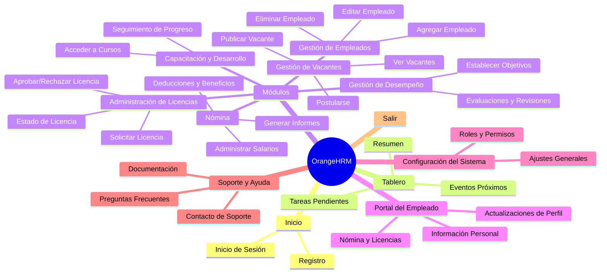

[TOC]

# Descripción del proyecto 

 <strong>   Analisis Funcional del sitio web OrangeHRM.com </strong>  
 

## 1. Resumen del proyecto 

El proyecto de automatización del sitio saucedemo.com consistió en desarrollar una serie de pruebas automatizadas utilizando el framework Selenium con el lenguaje de programación Java. El propósito principal fue demostrar habilidades en automatización de pruebas y garantizar la calidad del sitio web bajo prueba.

## 2. Objetivos

- Automatizar pruebas de funcionalidad para mejorar la eficiencia y precisión de las pruebas.
- Reducir el tiempo y los recursos requeridos para realizar pruebas manuales.
- Detectar errores y problemas en el sitio web de manera temprana.

## 3. Alcance

En el proyecto se realizará la automatización de los casos de prueba para validar las siguientes funcionalidades: 

 - **Inicio de Sesión**
 - **Cierre de Sesión**
 - **Generación de una orden de compras**
 - **Ordenar productos** 

## 4. Tecnologías utilizadas

Para la construcción del proyecto se emplearon las siguientes tecnologías , librerías , técnicas y herramientas de desarrollo:

### 4.1 Tecnologías 

- **Selenium Web Driver:** Framework de automatización de pruebas para interactuar con los elementos de la interfaz de usuario.
- **Java**: Lenguaje de programación utilizado para desarrollar las pruebas automatizadas. 
- **TestNG**: Framework de pruebas utilizado para la ejecución y gestión de los casos de prueba.
- **Maven**: Gestor de dependencias utilizado para la gestión del proyecto.

### 4.2 Herramientas

- **IDE** : Eclipse

## 5. Arquitectura de las pruebas

El proyecto sigue el patrón **Page Object Model (POM)** para una mejor organización y mantenibilidad. Los elementos de la interfaz de usuario se encuentran separados en clases individuales, lo que permite un fácil mantenimiento y reutilización del código.

## 6. Casos de prueba

### 

## 7. Configuración y ejecución

- Se requiere tener instalado **Java Development Kit (JDK)** y **Maven** para ejecutar las pruebas.
- Las dependencias y configuraciones necesarias están definidas en el archivo pom.xml.
- Para ejecutar las pruebas, se utiliza el comando `mvn test` en la terminal o se ejecutan los archivos de prueba individualmente.

## 8. Resultados y métricas

## 9. Capturas de pantalla y ejemplos

Se adjuntan las evidencias del correcto funcionamiento de los scripts realizados:

## 10. Lecciones Aprendidas: Skills 
- Maven Project 
 - TestNG : CrossBrowsing, Data Provider , Test Report.
 - JUnit
 - Page Object Model
 - Page Factory
 - CrossBrowsing

